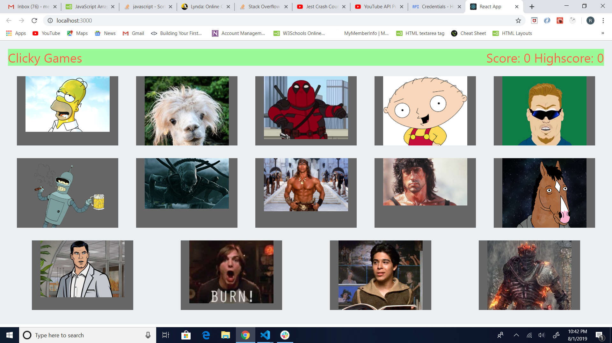
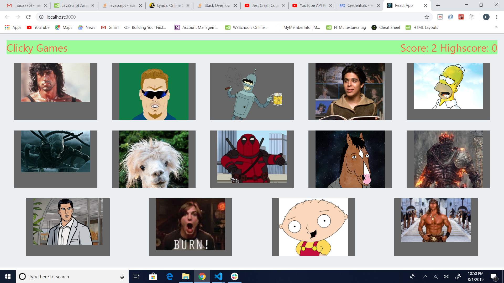
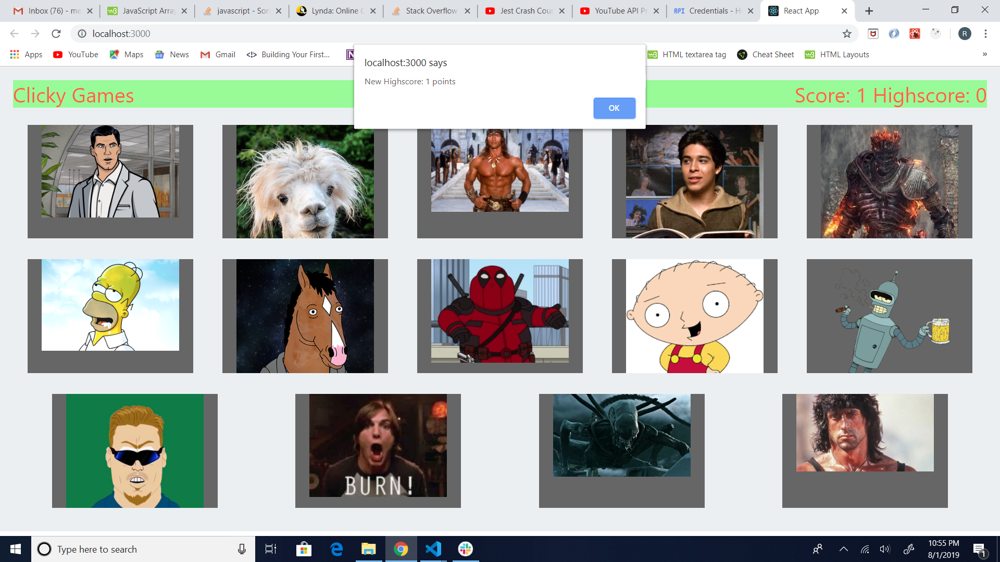

# clickyGame

The ClickyGame is a game where you click the images to get a point. This was made from react.js

# Features

This is the first assignment I made for react.js. The images are various Characters for movies and T.V. shows that I like.

# Installation

The way I created this game is typed in the command create-react-app myapp. The command to start running the site on localhost is npm start

# How to use

To play the game, you click one of the fourteen images displayed on the page. Once you click an image, you will recieve a point. The images will also shuffle in a random order. If you click the same image twice, The game will end and you will recieve a highscore. You will get an alert of your new highscore. You will get the alert again once you beat your current highscore.

# Components

Card: The components to display the Cards And the images

Header: The component that displays the score and the highscore

Wrapper: The component that wraps the Card component

# Screenshots

This is the image when the site is deployed.

As you can see the images have shuffled when I obtained two points. They will always shuffle once you recieve a point.

This is the alert message when you click on the same image twice. This message will only appear when you recieve a new highscore.